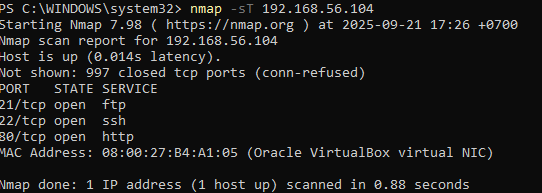
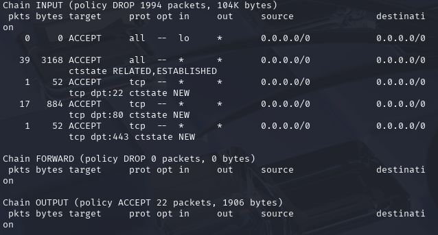
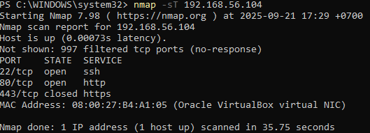

# Basic Firewall with iptables

Halo!👋 Gua bagas dan ini small project gue buat nunjukin cara buat **firewall sederhana** di Linux menggunakan **iptables**.  

Analogi gampang: firewall itu kayak **satpam rumah** yang cek siapa yang boleh masuk, siapa yang nggak.

---

## 🎯 Tujuan
- Membuat firewall dasar di Linux.  
- Membatasi port yang boleh diakses.  
- Tes menggunakan Nmap untuk buktiin rules bekerja(host Windows sebagai scanner) 
---

## Tools
- Kali Linux (target)
- Windows (Scanner/testing)
- `iptables` (di Kali) 
- `nmap` (di Windows)

---

## Step-by-step

1. **Update sistem & cek iptables**
```bash
sudo apt update && sudo apt upgrade -y
sudo iptables -V
```
2. **Nmap BEFORE (dari Windows host)**
```bash
nmap -sT 192.168.56.104
```
<p align="center">
  
</p> 

3. **Tambahkan Rules**
```bash
# Allow loopback (mengizinkan komunikasi internal localhost)
sudo iptables -A INPUT -i lo -j ACCEPT

# Allow established/related (balasan dari koneksi yang sudah ada)
sudo iptables -A INPUT -m conntrack --ctstate ESTABLISHED,RELATED -j ACCEPT

# Allow SSH, HTTP & HTTPS (web server)
sudo iptables -A INPUT -p tcp --dport 22 -m conntrack --ctstate NEW -j ACCEPT
sudo iptables -A INPUT -p tcp --dport 80 -m conntrack --ctstate NEW -j ACCEPT
sudo iptables -A INPUT -p tcp --dport 443 -m conntrack --ctstate NEW -j ACCEPT

# Default deny: semua koneksi masuk/forward diblok, keluar diizinkan
sudo iptables -P INPUT DROP
sudo iptables -P FORWARD DROP
sudo iptables -P OUTPUT ACCEPT
```
4.**Cek iptables setelah apply**
```bash
sudo iptables -L -v -n
```
<p align="center">
  
</p> 

5.**Nmap AFTER (dari Windows host)**
```bash
nmap -sT 192.168.56.104
```
<p align="center">
  
</p> 

6.**Save rules supaya tetap ada setelah reboot**
```bash
sudo apt install iptables-persistent -y
sudo iptables-save > /etc/iptables/rules.v4
```
Intinya: gue nge-set firewall dasar: semua incoming diblok kecuali port penting (SSH & HTTP). Setelah diterapkan, scanner dari host (Windows) nggak bisa menemukan port FTP lagi, yang artinya firewall bekerja. Simple tapi efektif untuk baseline security.
