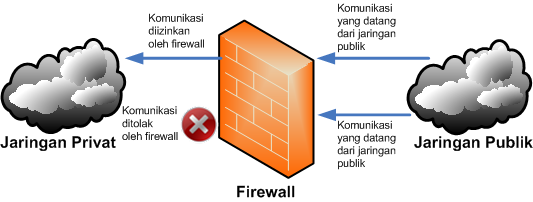

# Basic Firewall with iptables
<p align="center">
  
</p>

**Halo!** 👋  
Ini project kecil gue buat nunjukin cara bikin **firewall sederhana** di Linux pakai **iptables**.  
Analogi gampang: firewall itu kayak **satpam rumah** — dia cek siapa yang boleh masuk, siapa yang nggak.

---

## 🎯 Tujuan
- Bikin firewall dasar di Linux.  
- Batasi port yang boleh diakses.  
- Tes pakai Nmap untuk buktiin rules bekerja.  
---

## Tools
- Linux (Ubuntu)  
- `iptables`  
- `nmap` untuk testing

---

## Langkah Singkat (Step-by-step)

1. **Update sistem & cek iptables**
```bash
sudo apt update && sudo apt upgrade -y
sudo iptables -V
